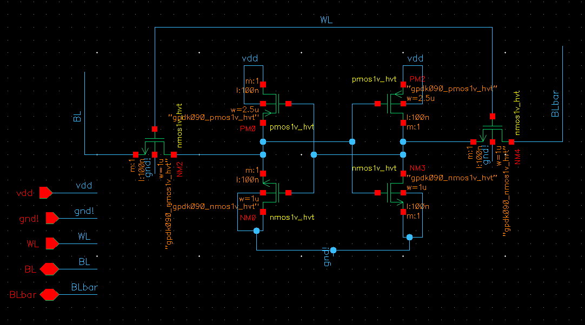
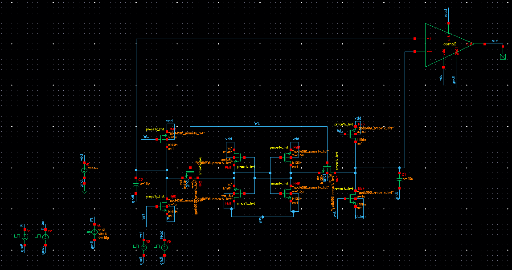
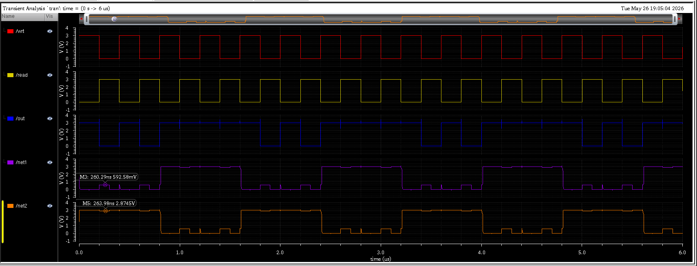
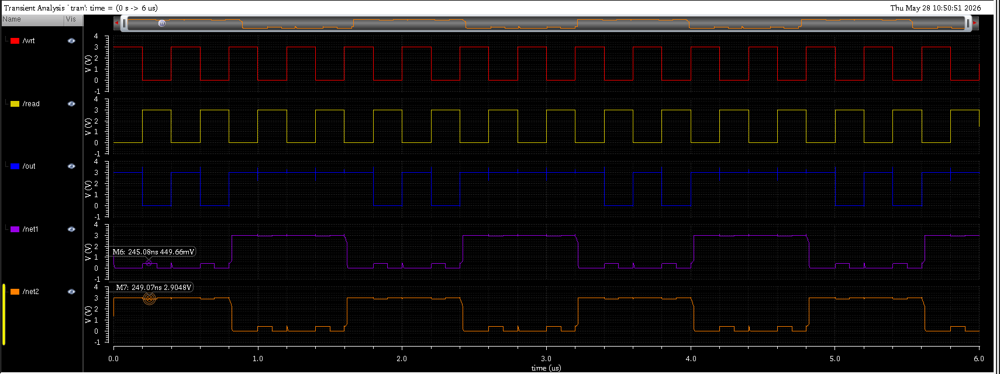
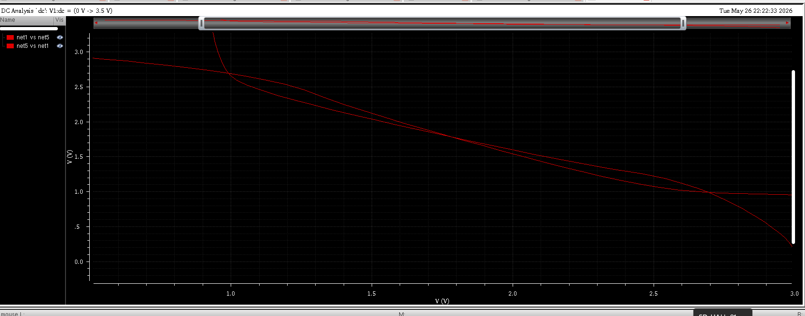
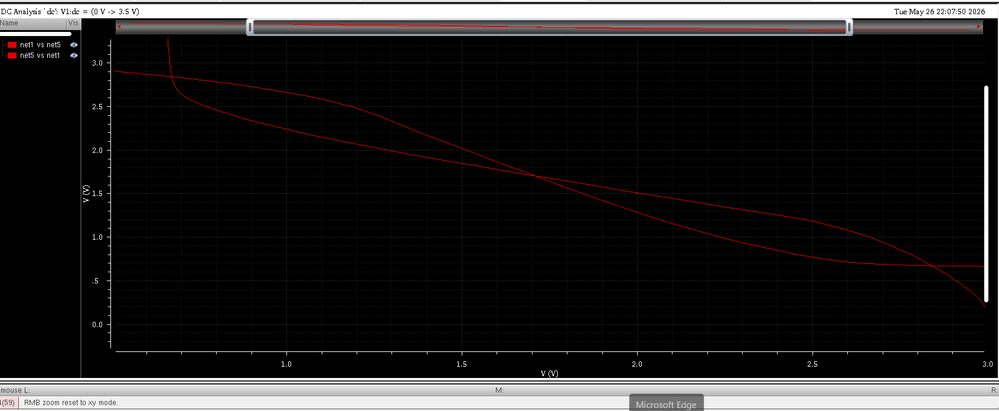
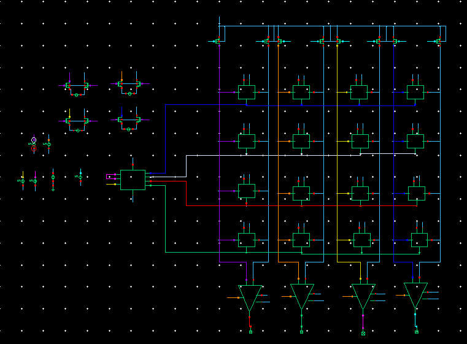
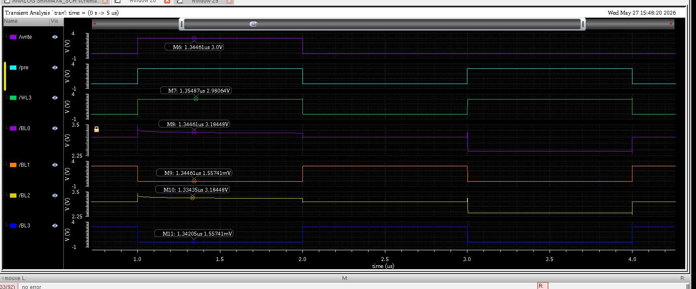
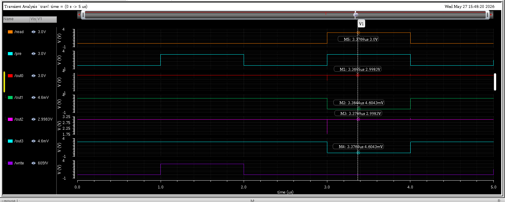
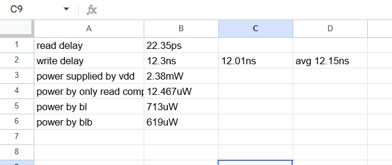

# 6T SRAM Cell and 4x4 SRAM Array Design in Cadence Virtuoso

Designed and analyzed a 6T SRAM bitcell and a 4x4 SRAM array in Cadence Virtuoso.  
This project includes read/write verification, precharge circuitry, comparator-based sensing, delay and power analysis, read disturb analysis, and SNM characterization.

---

# 1. Single 6T SRAM Cell

The basic 6T SRAM cell was designed using cross-coupled CMOS inverters and access transistors.

---

# 2. Single Cell Testbench

A dedicated testbench was created to verify read and write functionality of the SRAM cell.

---

# 3. Single Cell Read Disturb Analysis

During read operation, the internal storage node experienced voltage disturbance due to charge sharing through the access transistor.

## Original Read Disturb

### Observation
- Internal node voltage increased during read operation.
- Read disturbance was nearly 600mV initially.

---

## Improved Read Disturb After NMOS Sizing

To reduce the disturbance, pull-down NMOS transistor sizing was increased.

### Improvement
- Read disturbance reduced significantly.
- SRAM stability improved during read operation.

---

# 4. Butterfly Curve (SNM Analysis)

Static Noise Margin (SNM) analysis was performed using butterfly curves.

---

## Hold SNM

This represents SRAM stability without read access disturbance.

.png)

### Observation
- Larger butterfly opening.
- Better stability in hold mode.

---

## Read SNM

This curve was obtained during read condition with wordline enabled.

### Observation
- Butterfly opening reduced during read operation.
- Read disturbance lowered SNM.

---

## Improved SNM

After transistor sizing optimization, SNM improved.

### Improvement
- Increased butterfly opening.
- Better read stability.

---

# 5. 4x4 SRAM Array Design

A complete 4x4 SRAM array was constructed using multiple SRAM bitcells connected through common wordlines and differential bitlines.

### Features
- Shared differential bitlines
- Row-based wordline selection
- Column-wise sensing architecture
- Precharge circuitry

---

# 6. Write Operation and Memory Storage

Write operation was verified by storing a data pattern into the SRAM array.

### Observation
- Data pattern was successfully written into memory.
- Bitlines followed the applied input pattern correctly.

---

# 7. Read Operation and Comparator Outputs

Comparator-based sensing was used for reading stored data from the SRAM array.

### Observation
- Correct output pattern obtained during read operation.
- Differential bitline sensing worked successfully.

---

# 8. Delay and Power Analysis

Read delay, write delay, and power consumption were analyzed using transient simulations.

| Parameter | Value |
|---|---|
| Read Delay | 22.35 ps |
| Write Delay | 12.15 ns |
| Power supplied by VDD | 2.38 mW |
| Comparator Power | 12.467 uW |
| BL Power | 713 uW |
| BLB Power | 619 uW |

### Observation
- Read operation was significantly faster than write operation.
- Bitline charging/discharging contributed noticeable dynamic power.

---

# Tools Used

- Cadence Virtuoso
- Spectre Simulator
- Analog Design Environment (ADE)

---

# Key Features

- 6T SRAM Cell Design
- 4x4 SRAM Array Architecture
- Differential Bitline Operation
- Precharge Circuit Design
- Comparator-Based Read Sensing
- Read Disturb Analysis
- Static Noise Margin (SNM) Analysis
- Delay and Power Characterization
- SRAM Stability Improvement using Transistor Sizing

---

# Conclusion

Successfully designed and analyzed a 6T SRAM cell and a 4x4 SRAM array in Cadence Virtuoso.  
Read/write functionality, sensing operation, read disturb behavior, SNM characteristics, and power-delay performance were verified through simulation.
